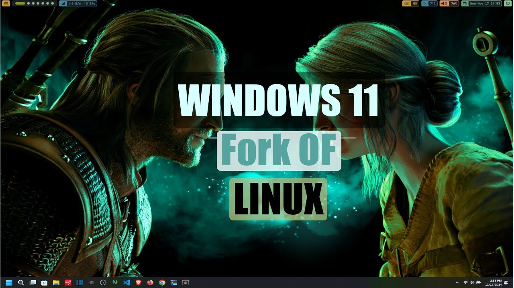
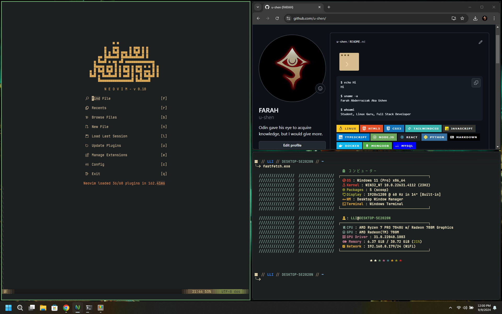

<h1 align="center"><i>Windows Ricing</i></h1>

### Watch The Rice Video

[](https://www.youtube.com/watch?v=T-dgnOKJNc4&t=43s)

<!---->

# philosophy

I try to follow these ideas as much as i can:

- using free/open source software.
- using terminal-based applications.
- using msys2 for development base and scoop for installing any other packages.
- avoid using software from microsoft like vscode, terminal, etc.. use more free alternative (Alacritty, Neovim) or compile linux versions with msys2.

## Tools 🛠️

While this configuration does prepare a great many tools, it revolves primarily around the following:

- 📝 [Neovide](https://neovide.dev/)
- ✏️ [Neovim](https://neovim.io)
- 🐠 [Nushell](nushell/nushell)
- 💻 [Alacritty](https://alacritty.org/)
- 🔠 [JetBrains Mono](https://www.jetbrains.com/lp/mono/)

### Miscellaneous Other Tools 🎒

- [bat](https://github.com/sharkdp/bat): A cat clone.
- [editorconfig](https://editorconfig.org/): Enforce some text styles.
- [eza](https://eza.rocks/): A modern, maintained replacement for ls.
- [fd](https://github.com/sharkdp/fd): Fast, user-friendly find.
- [fzf](https://github.com/junegunn/fzf): Command-line fuzzy finder.
- [delta](https://github.com/dandavison/delta): Syntax highlighting pager.
- [lazydocker](https://github.com/jesseduffield/lazydocker): Container management TUI.
- [lazygit](https://github.com/jesseduffield/lazygit): The best git interface outside emacs.
- [ripgrep](https://github.com/BurntSushi/ripgrep): Amazing search tool.
- [starship](https://starship.rs/): Customizable prompt.
- [xh](https://github.com/ducaale/xh): Friendly tool for sending http requests.
- [yazi](https://yazi-rs.github.io/): Simple file manager.
- [zoxide](https://github.com/ajeetdsouza/zoxide): A smarter cd command. Supports all major shells.

## for future

- i don't want to rely on supply chain. building software directly the pc is the best/safest way.(so i will ditch scoop | winget in future)
- it's better to replace c/c++ software with rust.
- In some cases it's better to use GUI applications.(like web-browsers)

## Install packages

**Change Execution Policy**

```powershell
Set-ExecutionPolicy -ExecutionPolicy RemoteSigned -Scope CurrentUser
```

```powershell
# =============================================================================== #
# Windows Packages:				                                                  #
# =============================================================================== #
# Change Execution Policy:                                                        #
# =============================================================================== #
# Set-ExecutionPolicy -ExecutionPolicy RemoteSigned -Scope CurrentUser => Recomanded
# Set-ExecutionPolicy RemoteSigned => RemoteSigned requires that scripts downloaded from the internet have a digital signature# Set-ExecutionPolicy Unrestricted -Scope LocalMachine =>
# Set-ExecutionPolicy Unrestricted -Scope LocalMachine => Unrestricted does not enforce any restrictions
# Set-ExecutionPolicy -ExecutionPolicy Bypass -Scope Process -Force => Bypass In Current Session Only
# Set-ExecutionPolicy Restricted => Revert to Default
# List Of Packages:	                                                              #
# =============================================================================== #
$uninstall = @(
    "Cortana",
    "Disney+",
    "LinkedIn",
    "Outlook for Windows",
    "AMD Radeon Software",
    "Microsoft.DevHome",
    "Dolby Access",
    "Quick Assist",
    "Windows Notepad",
    "Mail and Calendar",
    "Microsoft News",
    "Microsoft OneDrive",
    "Microsoft Tips",
    "Microsoft To Do",
    "Microsoft Sticky Notes",
    "Windows Clock",
    "MSN Weather",
    "Movies & TV",
    "Office",
    "OneDrive",
    "Spotify Music",
    "Windows Maps",
    "Xbox TCUI",
    "Xbox Game Bar Plugin",
    "Xbox Game Bar",
    "Game Bar",
    "Xbox",
    "Solitaire & Casual Games",
    "Gaming Services",
    "Get Help",
    "Microsoft Clipchamp",
    "Feedback Hub",
    "Phone Link",
    "Microsoft People",
    "Xbox Identity Provider",
    "Xbox Game Speech Window",
    "Power Automate"
)
$scoopPackages = @(
    "aria2",
    "curl",
    "nu",
    "carapace-bin",
    "gsudo",
    "alacritty",
    "windows-terminal",
    "yazi",
    "fd",
    "pastel",
    "fzf",
    "zoxide",
    "ripgrep",
    "neovim",
    "neovide",
    "chafa",
    "jq",
    "fastfetch",
    "bat",
    "glow",
    "tealdeer",
    "starship",
    "lazygit",
    "delta",
    "ntop",
    "zed",
    "chromium",
    "eza",
    "freetube",
    "komorebi",
    "obs-studio",
    "shotcut",
    "gimp",
    "thunderbird",
    "sumatrapdf",
    "JetBrainsMono-NF",
    "nodejs",
    "nvm",
    "gcc",
    "autohotkey",
    "marksman",
    "lua-language-server",
    "altsnap",
    "imagemagick",
    "ffmpeg",
    "yt-dlp",
    "ouch",
    "mpv",
    "oculante",
    "https://raw.githubusercontent.com/aandrew-me/tgpt/main/tgpt.json"
)

# UnInstall Packages:	                                                          #
# =============================================================================== #
# Write-Output "Uninstalling unnecessary apps such as OneDrive, Spotify, and Disney+..."
# foreach ($app in $uninstall) {
#     Write-Host "Remove $app..."
#     winget uninstall $app --silent --accept-source-agreements
# }
# Install Scoop Package Manager:	                                              #
# =============================================================================== #
if (-not (Get-Command scoop -ErrorAction SilentlyContinue)) {
    Write-Host "Installing Scoop ..."
    Invoke-RestMethod -Uri https://get.scoop.sh | Invoke-Expression
}
scoop bucket add extras
scoop bucket add nerd-fonts
foreach ($package in $scoopPackages) {
    Write-Host "Installing $package..."
    scoop install $package
}
Write-Host "Installation Of Scoop Packages Is Complete!"
```

---

## Enjoy 🤗
